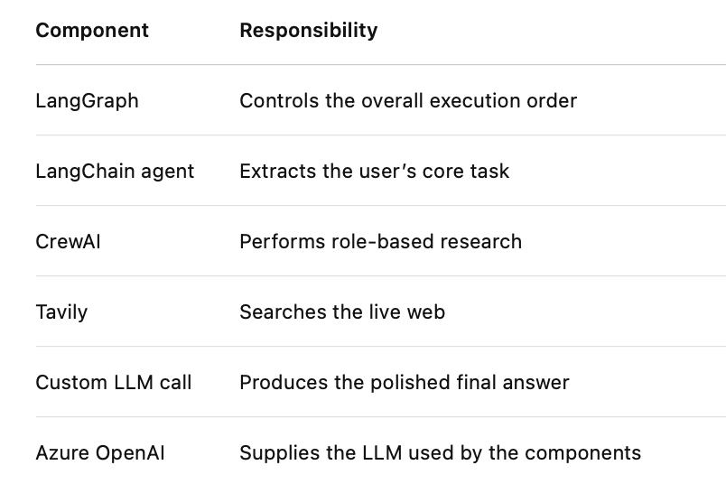

# Integrating Agents with LangGraph Using Google - A2A Protocol 
 
## Overview 
 
In this guided practice, you will orchestrate multiple AI agents using a modular, plug-and-
play architecture powered by the Agent-to-Agent (A2A) protocol with LangGraph. You will 
work with agents built using LangChain, CrewAI, and the OpenAI API, all connected into a 
single, state-aware workflow. 
 
This exercise demonstrates how user input is parsed, a research task is triggered through 
web tools, and a final response is synthesized. By the end of this session, you will 
understand how cross-framework agents collaborate at scale while maintaining shared 
context, enabling enterprise-ready GenAI workflows. 
 
## Instructions 
 
1. Define the agent interaction logic using LangChain, CrewAI, and the OpenAI API 
2. Orchestrate the workflow using LangGraph to connect agents 
3. Enable modular web research with CrewAI tools 
4. Generate final response output through the OpenAI API 
 
## Tasks 
 
- **Task 1**: Creating the LangChain agent 
Implement a LangChain ReAct agent that extracts the core task from user input. This 
ensures the system understands intent before passing it downstream. 
 
- **Task 2**: Building the CrewAI research agent 
Develop a CrewAI agent that uses a custom SearchTool (backed by Tavily search) to 
perform web research and return a structured summary of findings. 
 
- **Task 3**: Implementing the custom OpenAI API agent 
Define a function that calls OpenAI’s chat completion API (GPT-5) with the task and 
research results. This synthesizes a coherent, human-like response. 
 
- **Task 4**: Orchestrating agents with LangGraph 
Construct a stateful graph that links LangChain, CrewAI, and OpenAI nodes. The 
graph manages input, task extraction, research results, and final output. 
 
 
## Steps to be followed: 
1. Set up the environment 
2. Create the LangChain agent 
3. Build the CrewAI agent 
4. Define the custom OpenAI agent 
5. Integrate the agents with LangGraph 
6. Execute the pipeline 


# Summary
## How the three agent files connect
### LangChain file
```
Input:
Can you summarize the latest trends in GenAI for enterprise?

Output:
Summarize the latest trends in generative AI for enterprise.
```

### CrewAI file
```
Input:
Summarize the latest trends in generative AI for enterprise.

Action:
Search Tavily

Output:
Five research bullet points
```

### Custom OpenAI file

```
Input:
Task + five research bullet points

Action:
Ask Azure OpenAI to compose the final answer

Output:
Polished final response
```

#### So the full responsibility split is:
```
LangChain agent
Understands what the user wants
        ↓
CrewAI agent
Researches current information
        ↓
Custom LLM component
Writes the final answer
```

# **main.py** - The orchestractor
It connects the three agent components and controls the order in which they run
The flow is:
```
User input
   ↓
LangChain node
   ↓
CrewAI node
   ↓
OpenAI response node
   ↓
Final output
```
## What each technology is doing

